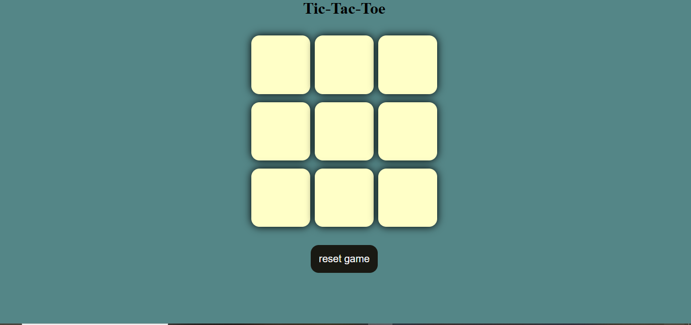

# Tic-Tac-Toe_Game
This project is a web-based Tic-Tac-Toe game created using HTML, CSS, and JavaScript. Two players can play the game by placing X or O alternately. The game automatically checks for winning conditions across rows, columns, and diagonals.

## Features
- Two-player gameplay (X vs O)
- Real-time win detection
- Reset and new game options
- Clean and user-friendly interface

## Technologies Used
- HTML  
- CSS  
- JavaScript  

## Screenshots

## How to Run
Open `index.html` in any modern web browser to start playing.

## Author
- Yasaswa Ambati
